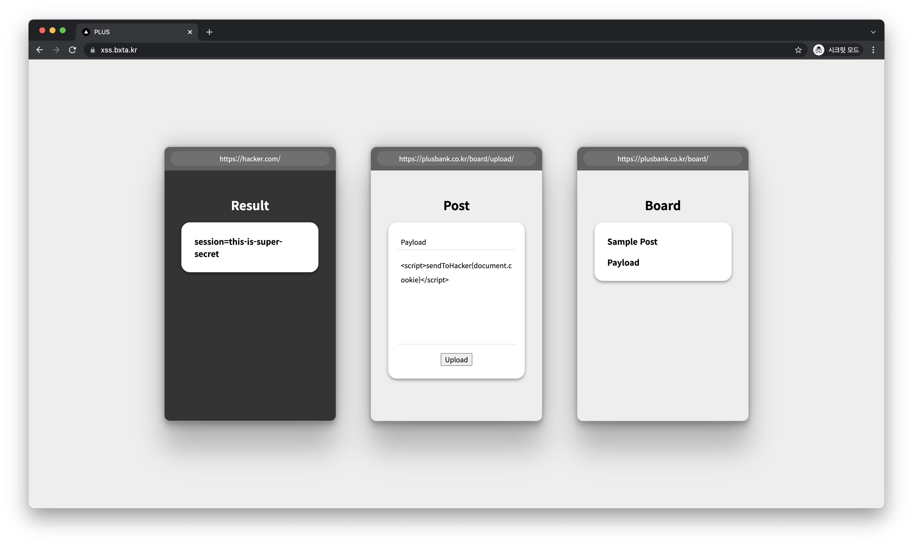

# XSS Demo

It is XSS demo page used for "[POSTECH](https://postech.ac.kr) Hacking Camp". It shows three virtual viewpoints: Hacker's view, Posting view, Victim's view.

## Objective

Students need to invoke `sendToHacker(str)` at victim's page. Then, parameter string is shown at hacker's result page.

## Structure

This is a [Next.js](https://nextjs.org/) project bootstrapped with [`create-next-app`](https://github.com/vercel/next.js/tree/canary/packages/create-next-app).
Objective function `sendToHacker` is injected in `window`.

## Reference
- [Dockerfile](https://github.com/vercel/next.js/tree/canary/examples/with-docker)